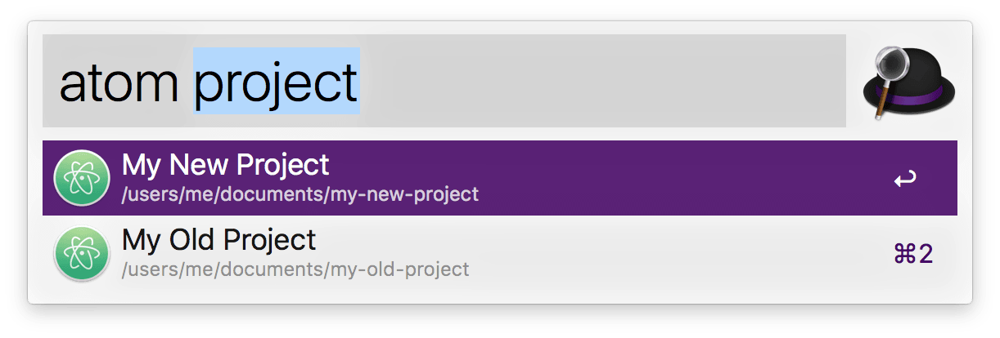

# Alfred Atom Workflow

Simple workflow that allows you to browse and open [Atom](https://atom.io/) projects.

## Requirements

* [NodeJS](https://nodejs.org/)
* [Atom Project Manager package](https://atom.io/packages/project-manager)

## Usage

Simply type <kbd>atom</kbd> followed by space to list all projects. Optionally type a search string to filter results.

