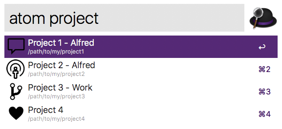

# Alfred Atom Workflow

Simple workflow that allows you to browse and open [Atom](https://atom.io/) projects.

## Requirements

- [NodeJS](https://nodejs.org) 8+
- [Atom Project Manager package](https://atom.io/packages/project-manager)
- Alfred 4 with paid [Alfred Powerpack](https://www.alfredapp.com/powerpack)

## Installation

### NPM

This workflow can be installed with NPM, as an added bonus you'll get a notification when an update is available!

```shell
npm install -g alfred-atom
```

### Packal / GitHub

Download the latest `Atom.alfredworkflow` from [Packal](http://www.packal.org/workflow/atom) or [GitHub](https://github.com/Cloudstek/alfred-atom/releases) and import it in Alfred.

## Usage

Simply type `atom` followed by space to list all projects. Optionally type a search string to filter results.



## Troubleshooting

> No projects are listed by the `atom` command

You most likely have an invalid `projects.cson` file. Some edge cases may be handled by the Atom Project Manager package but not handled in Alfred Atom Workflow. Check that the format matches https://github.com/danielbrodin/atom-project-manager#example.

Also check out the debug output, see the [Using the Workflow Debugger](https://www.alfredapp.com/help/workflows/advanced/debugger/) section of the Alfred documentation.